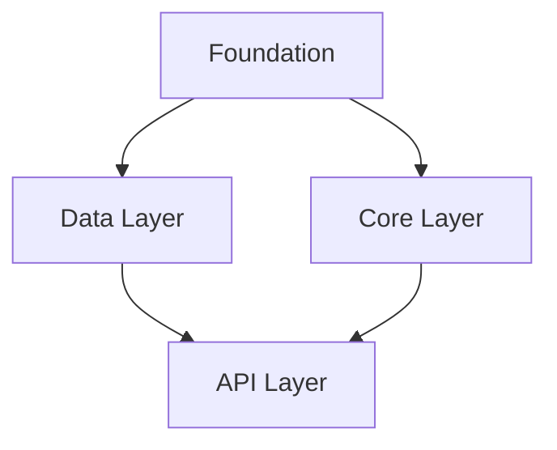

# RPG PRD Generation

Generate an RPG-structured PRD from analyzed research materials or conversation context.

## Usage

```
/rpg-prd generate <project-name>
```

## Process

### 1. Load Research Materials

Check if `.prd/research/manifest.json` exists:
- If yes: Load all analyzed files from `.prd/research/analyzed/`
- If no: Use conversation context and prompt for requirements if needed

### 2. Create PRD Directory

```bash
mkdir -p .prd/$ARGUMENTS
```

### 3. Synthesize Research into RPG Structure

Using research materials, generate comprehensive PRD following RPG methodology.

#### Section 1: Overview

**Problem Statement**: Core problem being solved

**Target Users**: Who benefits and their workflows

**Success Metrics**: Quantifiable outcomes (SMART criteria)

#### Section 2: Functional Decomposition (Capability Tree)

Identify high-level **Capabilities** (major system functions)

For each capability, enumerate **Features** with:
- Description (one sentence)
- Inputs (what it needs)
- Outputs (what it produces)
- Behavior (key logic)

Use explore-exploit strategy:
- Exploit: Required features for core value
- Explore: Features that make the domain complete

#### Section 3: Structural Decomposition (Repository Structure)

Map capabilities to code:
- Each Capability → Module (folder)
- Each Feature → File/function
- Define clear module boundaries
- Specify exports for each module

Create concrete file tree:
```
project-root/
├── src/
│   ├── [module]/
│   │   ├── [feature].ts
│   │   └── index.ts
```

#### Section 4: Dependency Graph (CRITICAL)

**Most important section for Task Master parsing.**

1. **Foundation Layer** (Phase 0, no dependencies):
   - Error handling, config, base types

2. **Build layers upward**:
   - Each module lists explicit dependencies
   - Format: `**Module**: Depends on [dep1, dep2]`

3. **Verify no circular dependencies**

4. **Order modules in topological sort**

Create Mermaid diagram:


#### Section 5: Implementation Roadmap (Phases)

Convert dependency graph to development phases.

For each phase:
- **Phase N: [Name]**
- **Goal**: What capability this establishes
- **Entry Criteria**: What must exist before starting
- **Tasks**: Specific implementation items with:
  - Task name
  - Dependencies (from earlier phases)
  - Acceptance criteria
  - Test strategy
- **Exit Criteria**: Observable outcome proving completion
- **Delivers**: What becomes possible after

**Rules:**
- Phase 0 = Foundation (no dependencies)
- Tasks within a phase can be parallelized
- Each phase builds toward something usable

#### Section 6: Test Strategy

- Test pyramid ratios (unit/integration/e2e)
- Coverage requirements
- Critical test scenarios per module:
  - Happy path
  - Edge cases
  - Error cases
  - Integration points

#### Section 7: Architecture

- System components and responsibilities
- Data models and schemas
- Technology stack with rationale
- Key design decisions with trade-offs

#### Section 8: Risks

For each risk:
- Impact, Likelihood, Mitigation, Fallback

Types:
- Technical risks (complexity, unknowns)
- Dependency risks (blockers)
- Scope risks (creep, underestimation)

### 4. Determine Size and Partitioning

Estimate total content size:

**Decision Point:**
- If total < 2000 lines: Write as single `overview.md`
- If total >= 2000 lines: Auto-trigger partitioning (see partition.md)

### 5. Write PRD Files

#### For Small PRDs (< 2000 lines)

Write to `.prd/$ARGUMENTS/overview.md`:

```markdown
# PRD: [Project Name]

## Problem Statement
[Content]

## Target Users
[Content]

## Success Metrics
[Content]

---

## Capability Tree

### Capability: [Name]
[Features...]

---

## Repository Structure
[File tree and module definitions]

---

## Dependency Graph
[Mermaid diagram]
[Dependency chain by layer]

---

## Implementation Roadmap

### Phase 0: Foundation
[Tasks...]

### Phase 1: [Name]
[Tasks...]

---

## Test Strategy
[Content]

---

## Architecture
[Content]

---

## Risks
[Content]
```

Also create `manifest.md`:

```markdown
# PRD Manifest: [Project Name]

## Quick Context
[One paragraph summary]

## Files
- `overview.md` - Complete PRD document

## Usage
Load with Task Master:
```bash
/prd-taskmaster init .prd/[project]/overview.md
```
```

#### For Large PRDs (>= 2000 lines)

Automatically invoke partitioning (see partition.md):
1. Create `manifest.md` with summary and navigation
2. Create `dependency-graph.md` with full diagram
3. Create `overview.md` with problem, users, capabilities, structure
4. Create `phase-N-[name].md` for each phase

### 6. Output Summary

```
## PRD Generated: [Project Name]

### Location
.prd/[project-name]/

### Files Created
- manifest.md
- overview.md
[- dependency-graph.md]
[- phase-0-foundation.md]
[- phase-N-xxx.md]

### Statistics
- Capabilities: [count]
- Features: [count]
- Modules: [count]
- Phases: [count]
- Tasks: [count]

### Dependency Summary
[Mermaid diagram preview]

### Next Steps

**Option 1: Load specific phase**
```
/rpg-prd load [project]:phase-1
```

**Option 2: Initialize Task Master**
```
/prd-taskmaster init .prd/[project]/overview.md
```

**Option 3: Use directly**
Read the PRD files and implement manually.
```

## RPG Methodology Principles

1. **Dual-Semantics**: Separate WHAT (functional) from HOW (structural)
2. **Explicit Dependencies**: Every module states its dependencies
3. **Topological Order**: Foundation first, then layers
4. **Progressive Refinement**: Broad to specific

## Error Handling

- No research found: Suggest running research or use conversation context
- Invalid project name: Sanitize to filesystem-safe name
- Write failures: Report specific file that failed

## Notes

- Large PRDs automatically partitioned for progressive disclosure
- Manifest + dependency-graph + any single phase = complete working context
- Works standalone or with Task Master
